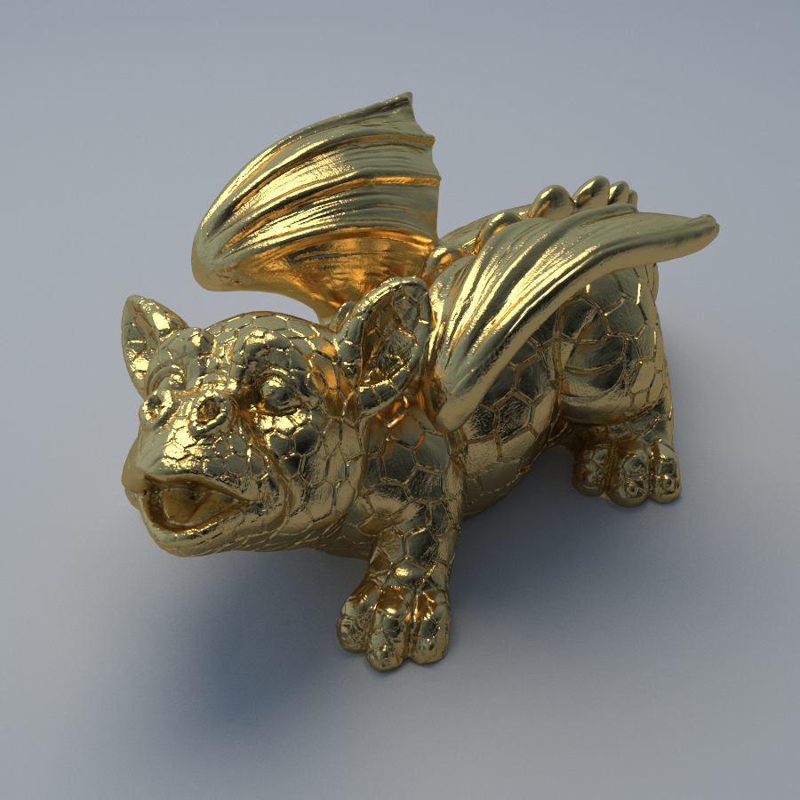

# Go Progressive Raytracer

A high-performance progressive raytracer written in Go that renders photorealistic images with support for multiple materials, lighting, and complex geometries.

Built following the excellent [Ray Tracing in One Weekend](https://raytracing.github.io/) series with additional techniques from [Physically Based Rendering: From Theory to Practice](https://www.pbrt.org/).

Developed using [Cursor](https://cursor.sh/) with Claude-4-Sonnet for AI-assisted programming.

## Features

- **Progressive Rendering**: Watch your renders improve in real-time across multiple passes
- **Multi-threaded**: Parallel processing with configurable worker pools
- **Rich Materials**: Lambertian, metal, glass, dielectric, and emissive materials
- **Complex Geometry**: Spheres, planes, triangle meshes, and PLY file support
- **Advanced Lighting**: Area lights, environment lighting, and physically-based illumination
- **Web Interface**: Real-time progressive rendering via web browser
- **BVH Acceleration**: Optimized ray-triangle intersection for complex scenes

## Progressive Rendering

Watch how the image quality improves with more samples per pixel:

| 1 Sample | 8 Samples | 64 Samples | 512 Samples | 4096 Samples |
|----------|-----------|------------|-------------|--------------|
|  |  |  |  |  |
| *136ms* | *911ms* | *6.1s* | *51s* | *7m20s* |

*Progressive rendering allows you to see results immediately and stop when quality is sufficient for your needs.*

## Sample Renders

### Default Scene


*Spheres with various materials (metal, glass, lambertian) on a ground plane*  
*4096 samples • 1m37s render time*

### Cornell Box


*Cornell box with rotated boxes, area lighting, and realistic materials*  
*4096 samples • 7m20s render time*

### Sphere Grid


*Grid of metallic spheres showcasing BVH acceleration and parallel rendering*  
*1024 samples • 7m27s render time*

### Triangle Mesh


*Complex triangle mesh geometry with procedurally generated shapes*  
*1024 samples • 1m37s render time*

### Dragon Mesh


*Stanford Dragon PLY mesh with 1.8 million triangles demonstrating BVH performance*  
*512 samples • 8m21s render time*

## Quick Start

### Prerequisites
- Go 1.24.3 or later

### Command Line Interface

```bash
# Clone the repository
git clone https://github.com/df07/go-progressive-raytracer.git
cd go-progressive-raytracer

# Build the executable
go build -o raytracer.exe main.go

# Render a scene
./raytracer.exe --scene=default --mode=progressive --max-passes=5
```

### Web Interface

The web interface provides real-time progressive rendering with live updates:

```bash
# Start the web server
cd web
go build -o web-server.exe main.go
./web-server.exe -port 8080

# Open http://localhost:8080 in your browser
```

**Web Features:**
- **Real-time streaming**: Watch renders improve live via Server-Sent Events
- **Interactive controls**: Adjust scene parameters, resolution, and quality
- **Multiple scenes**: Switch between all available scenes
- **Live statistics**: Monitor rendering progress and performance
- **Responsive design**: Works on desktop and mobile


*Real-time progressive rendering in your browser*

## Available Scenes

- **default** - Spheres with various materials on a ground plane
- **cornell** - Classic Cornell box with area lighting
- **cornell-boxes** - Cornell box with rotated boxes
- **spheregrid** - Grid of metallic spheres (perfect for BVH testing)
- **trianglemesh** - Showcase of triangle mesh geometry
- **dragon** - Dragon PLY mesh from PBRT book

## Rendering Modes

- **normal** - Standard single-pass rendering
- **progressive** - Multi-pass progressive improvement with parallel processing

## Example Commands

```bash
# Quick preview (3 passes, 25 samples)
./raytracer.exe --scene=cornell --mode=progressive --max-passes=3 --max-samples=25

# High quality render (10 passes, 200 samples)
./raytracer.exe --scene=default --mode=progressive --max-passes=10 --max-samples=200

# Use specific number of CPU cores
./raytracer.exe --scene=spheregrid --mode=progressive --workers=4

# CPU profiling
./raytracer.exe --scene=default --mode=normal --profile=cpu.prof
```

## Performance

- **Progressive Preview**: First pass renders in ~25-70ms
- **Multi-threaded**: ~2x speedup with 4+ CPU cores
- **BVH Acceleration**: Up to 39x faster for complex triangle meshes
- **Memory Efficient**: Tile-based rendering with adaptive sampling

## Architecture

Built with clean separation of concerns:
- `pkg/core/` - Foundation types and interfaces
- `pkg/geometry/` - Shape primitives and acceleration structures
- `pkg/material/` - Material implementations
- `pkg/renderer/` - Ray tracing engine and progressive rendering
- `pkg/scene/` - Scene management and presets
- `web/` - Web interface with real-time streaming

## Output

Rendered images are saved to `output/<scene_name>/render_<timestamp>.png`

Progressive mode saves intermediate passes: `render_<timestamp>_pass_<N>.png`

## License

This project is licensed under the MIT License - see the [LICENSE](LICENSE) file for details. 